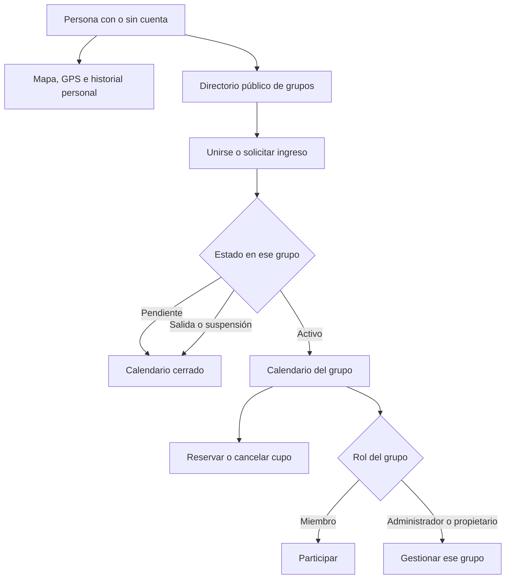

# RollersMaps 1.4.0 — Uso y transición

20 de septiembre de 2026 · Manuel Salinas

## Qué cambia

RollersMaps pasa a servir a cualquier persona que patine. Cada grupo tiene su
propio calendario, miembros y administración. Tener una cuenta no inscribe a la
persona en Santiago Rollers ni en otro grupo. La pertenencia no exige un pago.

| Función | Sin cuenta | Cuenta sin grupos | Miembro activo | Administrador del grupo |
|---|---|---|---|---|
| Mapa y GPS personal | Sí | Sí | Sí | Sí |
| Guardar varios recorridos en el teléfono | Sí | Sí | Sí | Sí |
| Compartir una imagen del recorrido | Sí | Sí | Sí | Sí |
| Respaldar recorridos en la cuenta | — | Sí | Sí | Sí |
| Descubrir grupos | Sí | Sí | Sí | Sí |
| Solicitar ingreso | Iniciar sesión | Sí | Sí, a otros grupos | Sí |
| Calendario y reservas de un grupo | — | — | Solo sus grupos | Solo sus grupos |
| Gestionar actividades y miembros | — | — | — | Solo su grupo |

Una solicitud pendiente no habilita el calendario. Cada grupo decide si acepta
el ingreso inmediatamente o requiere aprobación. Santiago Rollers parte con
aprobación. Una persona puede participar en varios grupos simultáneamente.

## Cuatro accesos

**Inicio:** Patinar libre es la acción principal. También permite abrir el
catálogo general y consultar la próxima actividad a la que se está inscrito.

**Calendario:** reúne únicamente las actividades de los grupos propios. Se puede
filtrar por grupo, reservar un cupo o cancelarlo. Los puntos de encuentro y los
horarios privados no se muestran como adelantos a personas ajenas al grupo.

**Grupos:** directorio, búsqueda, solicitudes y creación de grupos. El creador
queda como propietario. Desde el detalle del grupo se habilita su administración.

**Mis rutas:** historial personal, nombre del recorrido, métricas y opción de
compartir cualquier recorrido con trazado. Cada registro indica si está guardado
en el teléfono o respaldado en la cuenta.

## Guardado y respaldo

El recorrido se guarda primero en SQLite, dentro del teléfono. Al finalizar se
conserva en el historial y queda libre la sesión para una nueva salida. Solo puede
existir un recorrido activo o pendiente de guardar; empezar otro no lo sobrescribe.

Los recorridos de invitado se respaldan en una cuenta únicamente cuando la
persona elige hacerlo. El respaldo utiliza un identificador estable: reintentar
no debería crear una segunda copia. La cuenta se comprueba antes de cada envío.
Un fallo de conexión conserva la copia local.

Desinstalar la aplicación elimina sus datos locales. El respaldo en la cuenta
es la opción para conservarlos fuera del dispositivo. Los mapas base requieren
conectividad o mosaicos ya almacenados; no se promete un mapa completo sin internet.

## Administración

Un administrador puede publicar actividades, revisar solicitudes y retirar o
suspender miembros. El propietario también puede designar administradores y
transferir la propiedad. Debe transferirla antes de salir del grupo.

Al salir o ser retirado, se revoca el acceso al calendario y se cancelan las
reservas futuras de ese grupo. Los recorridos personales y las inscripciones
históricas no se borran. La transferencia de propiedad y el retiro de acceso
solicitan confirmación dentro de la aplicación.

El panel web mantiene su audiencia privada actual. Sus nuevos controles se
activan cuando exista la migración de grupos. Hasta entonces conserva el acceso
anterior para los administradores de Santiago Rollers.

## Cómo se protege el acceso

La base comprueba la identidad y el grupo en cada lectura o cambio. También se
protege la función del calendario usada por versiones antiguas. Ocultar una
pestaña no es la protección: las reglas se aplican en el servidor.

## Eficiencia

- El calendario y los grupos comparten una carga de datos. Se actualizan al
  regresar a la aplicación y periódicamente mientras está visible.
- Las respuestas de una cuenta o un grupo anterior no reemplazan la pantalla actual.
- El trazado GPS se reutiliza cuando no hay coordenadas nuevas; el reloj no
  reconstruye toda la ruta cada segundo.
- Las escrituras GPS se serializan y descartan saltos, ruido y señales imprecisas.
- Las reservas comprueban capacidad en una transacción. El resumen administrativo
  cuenta inscritos en el servidor, evitando descargar todas las inscripciones.
- El calendario limita la respuesta a 500 actividades dentro de su ventana
  temporal; el historial de nube carga las 100 más recientes.

## Validación y pendientes de publicación

Las pruebas automáticas cubren PostgreSQL local con políticas reales, SQLite,
filtrado GPS, solicitudes, aislamiento entre grupos, reservas y respaldo por
cuenta. Se ejecutan juntas con `npm run verify`.

La prueba de último cupo comprueba la secuencia de reservas y su repetición. No
equivale todavía a una prueba de dos conexiones reales simultáneas. Tampoco
sustituye una salida con pantalla bloqueada en teléfonos físicos.

Antes de activar Supabase: obtener conexión administrativa, ejecutar la revisión
de solo lectura, respaldar esquema y datos, revisar las funciones existentes y
aplicar la migración completa. La credencial recibida no se incorpora al código
ni a este documento. La dirección directa de la base no respondió desde el equipo;
están pendientes los datos de Session pooler.

Git respalda el código; el respaldo de la base debe hacerse por separado. La
versión estable 1.3.3 tiene una etiqueta y un archivo de respaldo independientes.
La base remota todavía no ha sido modificada por este trabajo.

## Referencias de producto

- [Clubes de Strava](https://support.strava.com/en-us/articles/15402172-clubs-on-strava).
- [Eventos de clubes de Strava](https://support.strava.com/en-us/articles/15401898-how-do-i-create-and-manage-group-events-for-my-club).
- [Conexiones de Supabase](https://supabase.com/docs/guides/database/connecting-to-postgres).
- [Expo SDK 57](https://docs.expo.dev/versions/v57.0.0/).

Se tomó la separación entre cuenta, club y evento como referencia. RollersMaps
mantiene sus propias reglas de privacidad y no integra cuentas ni datos de Strava.
