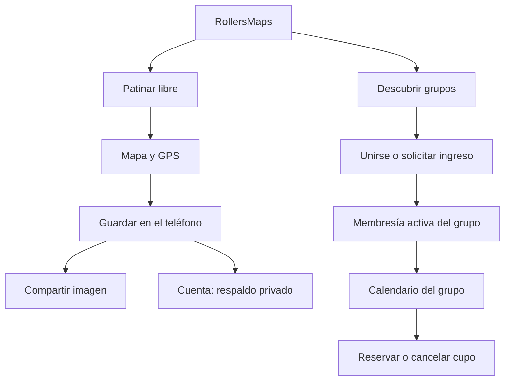

# RollersMaps 1.4.0 — Patinar libre y comunidades

## Acuerdo de producto

RollersMaps sirve a cualquier persona que patine. Una cuenta puede pertenecer a varios grupos; la pertenencia a uno no abre los calendarios de los demás. La membresía es independiente de cualquier pago.

- Mapa, GPS, historial local y compartir recorridos propios disponibles sin grupo.
- Invitado: registro y guardado en el teléfono. Cuenta: respaldo privado en la nube.
- Directorio público de grupos; calendarios y reservas accesibles solo a miembros activos.
- Santiago Rollers: ingreso por aprobación. Cada grupo puede elegir ingreso abierto o por aprobación.
- Propietario y administradores gestionan solo su grupo. Miembro, pendiente, bloqueado y salida son estados explícitos.
- Los usuarios existentes no se convierten automáticamente en miembros. Los administradores existentes gestionan Santiago Rollers; se conservan las inscripciones y los recorridos.

## Modelo de uso

## Navegación

Cuatro pestañas: Inicio, Calendario, Grupos y Mis rutas. Inicio ofrece Patinar como acción principal y un acceso secundario al catálogo. El calendario reúne solo los grupos propios y permite filtrarlos. Sin membresías muestra una invitación a descubrir grupos; un error de carga nunca se presenta como una agenda vacía.

## Implementación por etapas

1. Registrar pruebas previas y crear respaldo Git verificable.
2. Migración compatible de grupos, membresías y permisos, con pruebas de aislamiento, solicitudes, administración y último cupo.
3. Guardado local de múltiples recorridos terminados y sincronización idempotente. Mantener un solo recorrido activo.
4. Adaptar pantallas y administración, con estados de carga, error y lista vacía; evitar consultas repetidas y vaciar datos al cambiar de cuenta.
5. Pruebas automatizadas, compilación Android y recorrido en emulador. Registrar por separado lo que requiere teléfonos físicos o acceso administrativo remoto.

## Respaldo y reversión

- Base: 04bbbc7da4090b62c19bd5c8a34699a83d61c0d0 (1.3.3).
- Etiqueta: backup/v1.3.3-before-groups-20260920.
- Rama: feature/1.4.0-groups.
- Bundle verificado: RollersMaps-v1.3.3-respaldo.bundle, con historial completo.
- Validación previa: TypeScript y ESLint sin errores.
- Nunca revertir permisos de producción para recuperar una interfaz antigua: el despliegue de base de datos exige respaldo propio, ya que Git respalda código y no datos de Supabase.

## Criterios de aceptación

- Un invitado guarda más de un recorrido, reinicia y conserva su historial.
- Un usuario de A no lee ni modifica calendarios, reservas o miembros de B.
- Una solicitud pendiente no habilita el calendario; aprobarla sí, retirarla revoca el acceso.
- Dos reservas concurrentes para el último cupo producen solo una confirmación.
- Reintentar sincronización no duplica recorridos ni cambia de propietario.
- Salir de un grupo no borra recorridos personales.
- La administración funciona dentro del grupo y preserva los identificadores de actividades existentes.
- Compilación, comprobación de tipos, lint, pruebas y evidencia visual documentadas.

## Fuentes consultadas

- https://support.strava.com/en-us/articles/15402172-clubs-on-strava
- https://support.strava.com/en-us/articles/15401898-how-do-i-create-and-manage-group-events-for-my-club
- https://docs.expo.dev/versions/v57.0.0/

## Estado de continuidad — 20 de septiembre de 2026

Implementación de grupos, permisos, pantallas y guardado local terminada en la
rama de trabajo. Hay 25 pruebas automáticas aprobadas, comprobaciones de tipos
y calidad aprobadas, y compilaciones Android de desarrollo y autónoma exitosas.
La etiqueta de la versión estable también está en el repositorio remoto original.

El panel administrativo se publicó con compatibilidad para el esquema anterior.
Su audiencia privada se conserva. La aplicación de prueba se instala con un
identificador separado, sin reemplazar la estable.

La base remota NO se ha modificado. La conexión directa agotó el tiempo de espera;
se solicitaron host, puerto y usuario de Session pooler. La contraseña recibida
no se guardó en código ni documentación. Falta revisar el esquema real, respaldar
la base, activar la migración y validar las operaciones entre cuentas reales.

La revisión visual Android y el recorrido de prueba se registran por separado.
El GPS en teléfonos físicos, iOS y la reserva simultánea con dos conexiones reales
siguen pendientes. El manual vigente es MANUAL-1.4.0.md.
